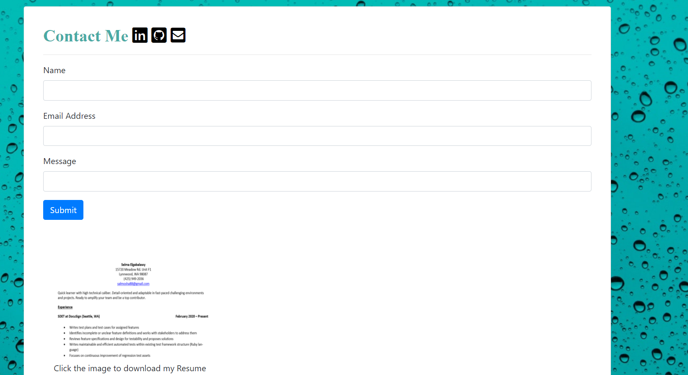

# Selma's HW2 Bootstrap Responsive Portfolio

## Description: 

In this homework, we are building the beginnings of our website/porfolio that hosts information about us and our work. It stores an 'about me' page, contact page, and a portfolio of our work. This website was built using mostly bootstrap with tiny bits of css tweaking for minor changes to fonts and colors. I added various bootstrap components as well as utilities. These included a navigation bar, contact information, cards, the grid, spacing/margin/padding mechanisms, and containers. I struggled a lot with this homework because I approached it with very detailed CSS in mind. I had no idea the full depth and capability of Bootstrap until later. This website is going to be the foundation and external display of my work. I will be able to build upon it as we progress to showcase my frontend.

## A couple of things I learned in this:

* The homework was approached incorrectly in the first place and this delayed me. I had very detailed modifications of margins and spacing by the pixel and realized late that it would not help me with maintaining a responsive website. I had to backtrack and start to use more Bootstrap.
* I learned that Bootstrap containers are theoretical containers that actually do not have physical containers. I found out very late that the Bootstrap card-body class would be my best friend in creating the actual physical containers I needed.
* I utilized a Google Chrome color eyedrop extension to pull the hexidecimal color results from the screenshots on Gitlab to colormatch. I also found another way to do this was through opening the images in Paint and setting an eyedropper to find out the r,g,b numbers.
* I originally had 3-4 different CSS files and could hardly manage, so I consolidated to one CSS file and three HTML files.
* I learned along the way that I needed both a Bootstrap stylesheet and the Javascript plugin. I did not realize this until a few days before submitting this assignment. It helped me add in the utilities I needed for spacing.

## Installation:

* If you need to pull my code for this homework, please visit my Github repository at: https://github.com/selma-e/hw2_bootstrap_responsive_portfolio
* If you want to see the final webpage for my code, please visit my hosted website at: https://selma-e.github.io/hw2_bootstrap_responsive_portfolio/

## Usage: 

## Resources Used/Credits:

* Bootstrap https://getbootstrap.com/docs/4.0/getting-started/introduction/
* z-index https://developer.mozilla.org/en-US/docs/Web/CSS/z-index
* float https://developer.mozilla.org/en-US/docs/Web/CSS/float
* !important; https://css-tricks.com/when-using-important-is-the-right-choice/
* Text formatting https://www.w3schools.com/css/css_text.asp

© 2020 Selma Elgabalawy | UW-SEA-FSF-PT-08-2020-U-C-TTh