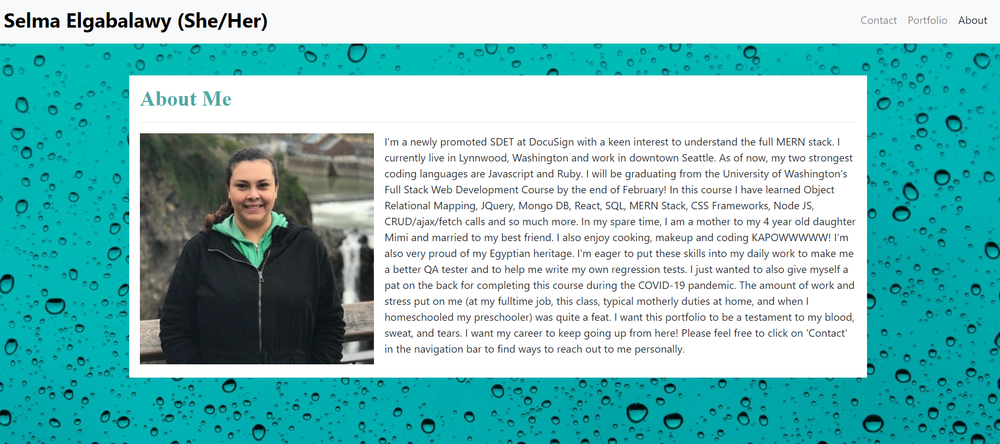

# Selma's HW2 Bootstrap Responsive Portfolio

## Description:

In this portfolio, we are building the beginnings of our website/porfolio that hosts information about us and our work. It stores an 'about me' page, contact page, and a portfolio of our work. This website was built using mostly bootstrap with tiny bits of css tweaking for minor changes to fonts and colors. I added various bootstrap components as well as utilities. These included a navigation bar, contact information, cards, the grid, spacing/margin/padding mechanisms, and containers. This website is going to be the foundation and external display of my work. I will be able to build upon it as we progress to showcase my frontend.

## Installation:

- If you need to pull my code for this homework, please visit my Github repository at: https://github.com/selma-e/hw2_bootstrap_responsive_portfolio/tree/portfolio_update_1
- If you want to see the final webpage for my code, please visit my hosted website at: https://selma-e.github.io/hw2_bootstrap_responsive_portfolio/

## Usage:

## Resources Used/Credits:

- Bootstrap https://getbootstrap.com/docs/4.0/getting-started/introduction/
- z-index https://developer.mozilla.org/en-US/docs/Web/CSS/z-index
- float https://developer.mozilla.org/en-US/docs/Web/CSS/float
- !important; https://css-tricks.com/when-using-important-is-the-right-choice/
- Text formatting https://www.w3schools.com/css/css_text.asp
- Giphy creator https://giphy.com/
- Font Awesome https://fontawesome.com/

© 2020 Selma Elgabalawy | UW-SEA-FSF-PT-08-2020-U-C-TTh
